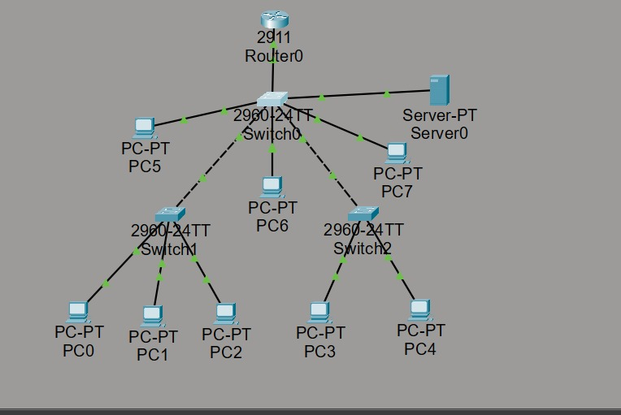
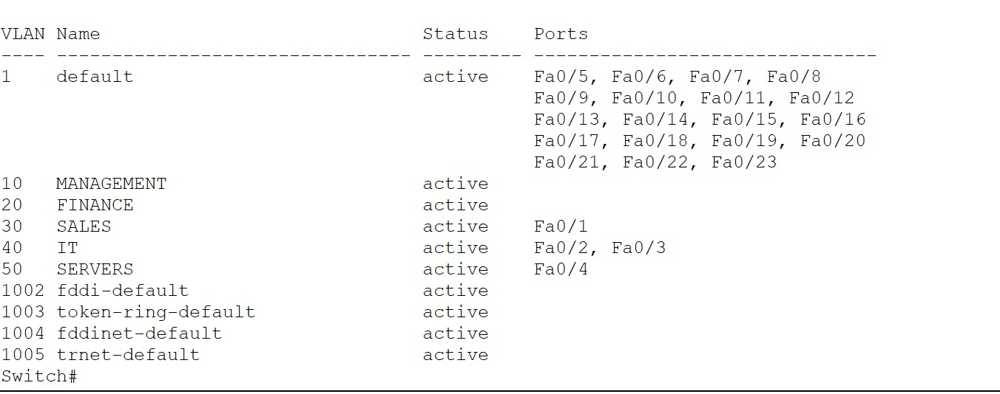
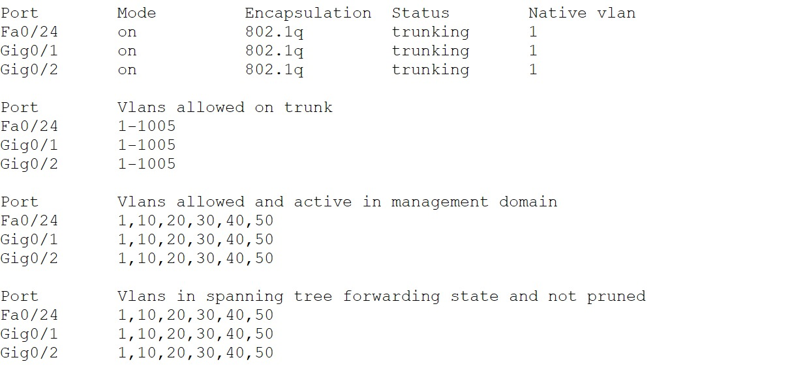
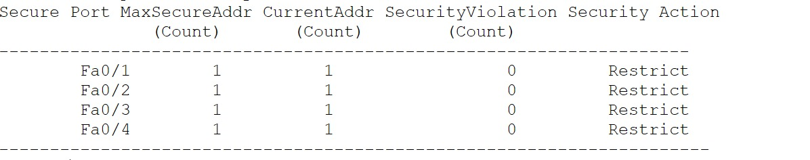
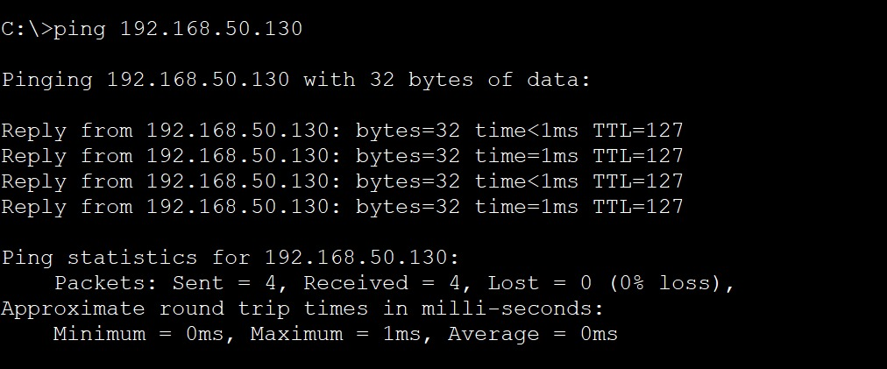

# Secure Multi-Department Office Network

## Project Overview
This project simulates a secure multi-department office network for a fictional company using Cisco Packet Tracer.

The goal was to apply CCNA networking concepts in a realistic business environment, including network segmentation, inter-VLAN routing, DHCP, switch security, monitoring, and troubleshooting.

## Business Scenario
The company contains multiple departments:

- Management
- Finance
- Sales
- IT
- Internal Servers

Each department is logically separated using VLANs while still allowing controlled communication through inter-VLAN routing.

## Technologies Used

- VLANs
- 802.1Q Trunking
- Router-on-a-Stick
- IPv4 Addressing
- VLSM
- DHCP
- Static Server Addressing
- Port Security
- Sticky MAC Addresses
- DHCP Snooping
- PortFast
- BPDU Guard
- NTP
- Syslog
- Inter-VLAN Routing
- Network Testing
- Troubleshooting

## Network Design

The network includes:

- 1 Cisco 2911 Router
- 3 Cisco 2960 Switches
- Multiple end-user PCs
- 1 Internal Server

VLANs used:

| VLAN | Department |
|------|------------|
| 10 | Management |
| 20 | Finance |
| 30 | Sales |
| 40 | IT |
| 50 | Servers |

## IP Addressing

| Department | Network |
|------------|---------|
| Sales | 192.168.50.0/26 |
| Finance | 192.168.50.64/27 |
| Management | 192.168.50.96/28 |
| IT | 192.168.50.112/28 |
| Servers | 192.168.50.128/28 |

The router provides default gateways for each VLAN using subinterfaces.

## Security Features

The network implements several Layer 2 security mechanisms:

- Port Security
- Sticky MAC address learning
- DHCP Snooping
- BPDU Guard
- PortFast on access ports

These controls help protect the network from unauthorized devices and common Layer 2 attacks.

## Testing and Verification

The network was tested using:

- `show vlan brief`
- `show interfaces trunk`
- `show port-security`
- DHCP address assignment
- Inter-VLAN ping tests
- Server connectivity tests

## Troubleshooting Scenario

A deliberate VLAN misconfiguration was introduced on an access port.

The affected device lost connectivity to its default gateway.

The issue was diagnosed by checking the switch port configuration and identifying the incorrect VLAN assignment.

The port was reassigned to the correct VLAN and connectivity was successfully restored.

This demonstrated a basic structured troubleshooting process:

**Problem → Diagnosis → Fix → Verification**

## Screenshots

### Network Topology

### VLAN Configuration

### Trunk Verification

### Port Security

### Connectivity Test

## Project File

The Cisco Packet Tracer project file is included in this repository:

`NovaCore_Secure_Office_Network.pkt`

## Skills Practiced

This project helped reinforce practical understanding of:

- Network segmentation
- Layer 2 switching
- Inter-VLAN routing
- IP addressing and subnetting
- Network security
- DHCP configuration
- Network monitoring
- Connectivity testing
- Troubleshooting
